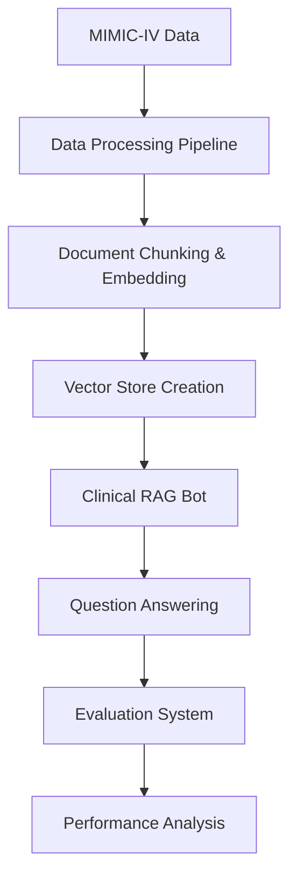

# Clinical RAG System for MIMIC-IV Data Analysis

A comprehensive Retrieval-Augmented Generation (RAG) system designed for analyzing clinical data from the MIMIC-IV dataset. This system enables natural language querying of patient medical records and provides a robust evaluation framework for comparing different language models and embedding approaches.

## 🏥 Project Overview

This project implements a production-ready clinical RAG system that:
- **Processes MIMIC-IV hospital data** into structured, searchable documents
- **Supports multiple embedding models** for optimal medical text representation
- **Enables conversational interaction** with patient medical records
- **Provides comprehensive evaluation metrics** for system performance assessment
- **Compares different LLM and embedding combinations** systematically

## 🏗️ System Architecture



### Core Components

1. **Data Processing Pipeline** (`data_handling/`)
   - Converts MIMIC-IV CSV data to structured documents
   - Creates semantic chunks optimized for clinical queries
   - Supports multiple vector stores with different embedding models

2. **Clinical RAG Bot** (`RAG_chat_pipeline/clinical_rag.py`)
   - Handles both single questions and conversational interactions
   - Supports admission-specific and global semantic search
   - Includes entity extraction for automatic parameter detection

3. **Evaluation Framework** (`RAG_chat_pipeline/rag_evaluator.py`)
   - Multi-dimensional scoring: Factual Accuracy (60%), Behavior (30%), Performance (10%)
   - Category-specific validation for different medical question types
   - Automated gold question generation from real patient data

4. **Model Comparison System** (`RAG_chat_pipeline/model_evaluation_runner.py`)
   - Systematic evaluation across 12 model combinations
   - Automated results collection and analysis
   - Performance visualization and reporting

## 📊 Supported Models

### Embedding Models
- **MS-MARCO-MiniLM** - Medical domain-optimized model
- **Multi-QA-MPNet** - Multi-domain question-answering model  
- **All-MiniLM-L6-v2** - General-purpose lightweight model
- **Static-Retrieval-MRL** - Static retrieval specialized model

### Language Models (via Ollama)
- **DeepSeek-R1** (1.5B) - Reasoning-focused model
- **Qwen2.5** (3B) - Multilingual capabilities
- **Llama3.2** (3B) - Meta's latest efficient model

## 🚀 Quick Start

### Prerequisites
```bash
# Install Python 3.11+ from https://python.org/downloads/
# Install Ollama: https://ollama.ai/

# Pull required LLM models
ollama pull deepseek-r1:1.5b
ollama pull qwen2.5:3b  
ollama pull llama3.2:3b
```

### Installation
```bash
# Clone repository
git clone <repository-url>
cd msc_project

# Create and activate virtual environment
python -m venv venv

# Activate environment:
# Windows:
venv\Scripts\activate.bat
# Linux/macOS:
source venv/bin/activate

# Install dependencies
pip install -r requirements.txt
```

### Automated Setup

For easier setup, use the provided scripts:

```bash
# Windows
setup_environment.bat

# Linux/macOS
chmod +x setup_environment.sh
./setup_environment.sh
```

### Data Setup

1. **Prepare MIMIC-IV Data**: Place sample data in `mimic_sample_1000/`
2. **Process Data**: Run `data_handling/creating_docs.ipynb` to:
   - Load and merge MIMIC-IV tables
   - Create semantic document chunks
   - Generate vector stores for all embedding models

### Usage Examples

#### Interactive Chatbot
```python
from RAG_chat_pipeline.main import main

# Initialize system
chatbot = main()

# Ask questions
response = chatbot.ask_question(
    "What lab values were abnormal for admission 25282710?",
    k=5
)
print(response['answer'])
```

#### Batch Evaluation
```bash
# Run all model combinations
cd RAG_chat_pipeline
python model_evaluation_runner.py all short

# Generate comparison report
python model_evaluation_runner.py report
```

#### Single Model Evaluation
```bash
# Evaluate specific combination
python model_evaluation_runner.py single ms-marco deepseek short

# Quick test
python rag_evaluator.py quick
```

## 📋 Clinical Data Structure

The system processes six types of medical records:

| Section | Content | Example Queries |
|---------|---------|-----------------|
| **Header** | Admission info, dates, types | "When was patient admitted?" |
| **Diagnoses** | ICD codes, conditions | "What diagnoses does admission X have?" |
| **Procedures** | Operations, interventions | "What procedures were performed?" |
| **Labs** | Test results, values, flags | "Show abnormal lab values" |
| **Microbiology** | Cultures, infections | "Were any cultures positive?" |
| **Prescriptions** | Medications, dosages | "What medications was patient on?" |

## 🎯 Evaluation Framework

### Scoring Methodology
- **Factual Accuracy (60%)**: Validates against actual patient data
- **Behavioral Assessment (30%)**: Checks appropriate clinical responses  
- **Performance Metrics (10%)**: Measures search speed and document retrieval

### Question Categories
- **Header Questions**: Admission details and administrative info
- **Diagnostic Questions**: Disease conditions and ICD codes
- **Procedural Questions**: Medical interventions and operations
- **Laboratory Questions**: Test results and abnormal values
- **Microbiology Questions**: Culture results and infections
- **Prescription Questions**: Medications and dosing information

### Automated Evaluation
```bash
# Full evaluation suite
python rag_evaluator.py full

# Short evaluation (10 questions)
python rag_evaluator.py short

# Quick test (3 questions)  
python rag_evaluator.py quick
```

## 📈 Performance Analysis

### Results Dashboard
The system generates comprehensive performance reports including:
- **Pass rates by model combination**
- **Category-specific performance breakdowns**
- **Search time and efficiency metrics**
- **Comparative analysis across embedding models**

### Visualization
- Performance heatmaps comparing model combinations
- Category breakdown charts
- Time series analysis of evaluation results

## 🗂️ Project Structure

```
msc_project/
├── data_handling/                 # Data processing notebooks
│   ├── creating_docs.ipynb       # Main data processing pipeline
│   └── converting_to_sql.ipynb   # Database conversion utilities
├── mimic_sample_1000/             # MIMIC-IV sample data
│   ├── *.csv                     # Raw clinical data files
│   ├── chunked_docs.pkl          # Processed document chunks
│   └── exports/                  # Preprocessed data exports
├── models/                       # Downloaded embedding models
│   ├── all-MiniLM-L6-v2/
│   ├── multi-qa-mpnet-base-cos-v1/
│   ├── S-PubMedBert-MS-MARCO/
│   └── static-retrieval-mrl-en-v1/
├── vector_stores/                # FAISS vector databases
│   ├── faiss_mimic_sample1000_mini-lm/
│   ├── faiss_mimic_sample1000_ms-marco/
│   ├── faiss_mimic_sample1000_multi-qa/
│   └── faiss_mimic_sample1000_static-retr/
├── RAG_chat_pipeline/            # Core RAG system
│   ├── clinical_rag.py          # Main RAG chatbot
│   ├── rag_evaluator.py         # Evaluation framework
│   ├── model_evaluation_runner.py # Automated model comparison
│   ├── evaluation_results_manager.py # Results analysis
│   ├── config.py                # System configuration
│   ├── main.py                  # Entry point
│   ├── embeddings_manager.py    # Model management
│   ├── entity_extraction.py     # Parameter extraction
│   ├── gold_questions.py        # Test question generation
│   ├── data_loader.py          # Data loading utilities
│   └── invoke.py               # LLM invocation wrapper
├── requirements.txt             # Python dependencies
├── setup_environment.bat       # Windows setup script
├── setup_environment.sh        # Linux/macOS setup script
└── README.md                   # This file
```

## 🛠️ Configuration

### Model Selection
Edit `RAG_chat_pipeline/config.py`:
```python
# Default embedding model
model_in_use = "ms-marco"  # Options: ms-marco, multi-qa, mini-lm, static-retr

# Default LLM model  
LLM_MODEL = llms["deepseek"]  # Options: deepseek, qwen, llama
```

### Evaluation Parameters
```python
# Scoring weights
EVALUATION_SCORING_WEIGHTS = {
    "factual_accuracy": 0.6,
    "behavior": 0.3, 
    "performance": 0.1
}

# Pass thresholds by category
EVALUATION_PASS_THRESHOLDS = {
    "labs": 0.65,
    "diagnoses": 0.75,
    "prescriptions": 0.70,
    # ...
}
```

## 🧪 Evaluation Results

### Example Performance Summary
```
📊 Model Comparison Report
Generated: 2025-01-16 10:30:15

## Overview
- Total Experiments: 12
- Embedding Models Tested: 4  
- LLM Models Tested: 3

## Best Performing Combinations
### Highest Overall Score
- Models: ms-marco + deepseek
- Overall Score: 0.847
- Pass Rate: 84.2%

### Category Performance
- Header Questions: 89.5% pass rate
- Lab Questions: 82.1% pass rate  
- Prescription Questions: 76.8% pass rate
```

## 🔬 Research Applications

This system is designed for:
- **Clinical Decision Support**: Natural language queries over patient records
- **Medical Education**: Interactive exploration of clinical cases
- **RAG System Benchmarking**: Standardized evaluation of clinical NLP models
- **Healthcare AI Research**: Foundation for medical language model development

## 🚦 System Status

- ✅ **Data Processing**: Complete MIMIC-IV integration
- ✅ **RAG Pipeline**: Multi-model support with conversation history
- ✅ **Evaluation Framework**: Comprehensive scoring and comparison
- ✅ **Model Comparison**: Automated evaluation across 12 combinations
- ✅ **Results Analysis**: Performance visualization and reporting

## 📚 Dependencies

### Core Libraries
- **LangChain**: RAG pipeline framework
- **FAISS**: Vector similarity search
- **SentenceTransformers**: Embedding model support
- **Ollama**: Local LLM hosting
- **Pandas**: Data manipulation
- **Matplotlib/Seaborn**: Visualization

### Model Requirements
- **Embedding Models**: ~1-2GB each (4 models)
- **LLM Models**: ~2-4GB each (3 models via Ollama)
- **Vector Stores**: ~500MB each (4 stores)

## 🤝 Contributing

This is an academic research project. For questions or collaboration:
1. Review the evaluation framework in `rag_evaluator.py`
2. Check model configurations in `config.py`
3. Run the example evaluations to understand the system
4. Refer to the data processing notebook for MIMIC-IV integration

## 📖 Citation

If you use this system in your research, please cite:
```bibtex
@software{clinical_rag_mimic,
  title={Clinical RAG System for MIMIC-IV Data Analysis},
  author={[Author Name]},
  year={2025},
  url={[Repository URL]}
}
```

## ⚠️ Medical Disclaimer

This system is for educational and research purposes only. It should not be used for medical diagnosis or treatment decisions. Always consult qualified healthcare professionals for medical advice.

## 📄 License

[MIT]

---

**🏥 Ready to explore clinical data with AI? Start with the Quick Start guide above!**
