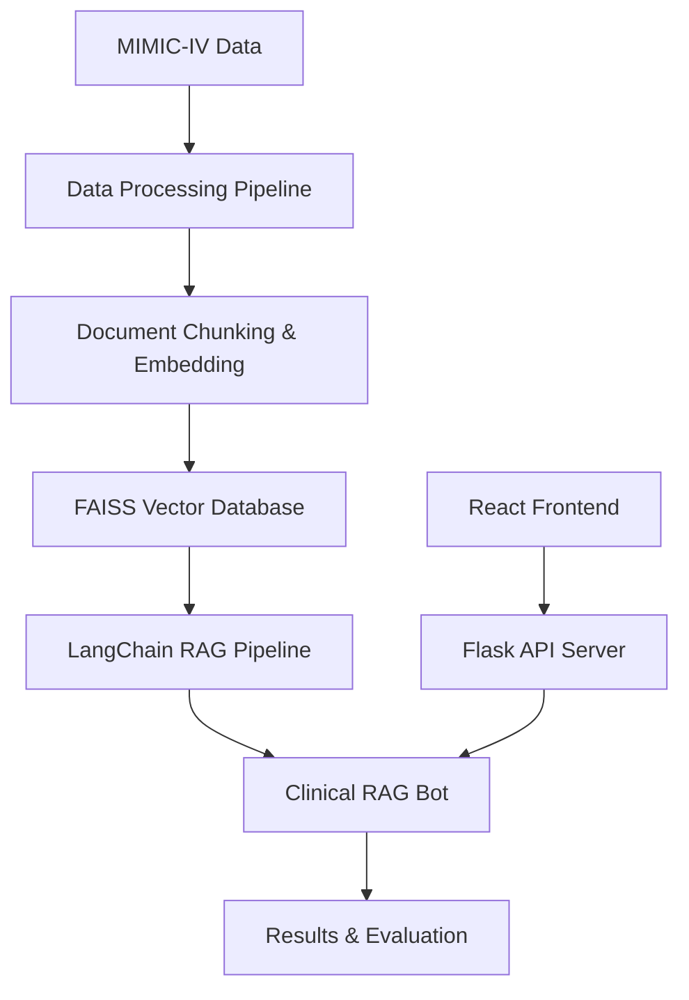

# Clinical RAG System for MIMIC-IV Data Analysis

A comprehensive Retrieval-Augmented Generation (RAG) system designed for analyzing clinical data from the MIMIC-IV dataset. This system enables natural language querying of patient medical records and provides a robust evaluation framework for comparing different language models and embedding approaches.

## 🏥 Project Overview

This project implements a production-ready clinical RAG system that:

- **Processes MIMIC-IV hospital data** into structured, searchable documents
- **Supports multiple embedding models** for optimal medical text representation
- **Enables conversational interaction** with patient medical records
- **Provides comprehensive evaluation metrics** for system performance assessment
- **Compares different LLM and embedding combinations** systematically
- **Includes a React-based web interface** for easy clinical data querying

## 🏗️ System Architecture



### Core Components

1. **Data Processing Pipeline** (`data_handling/`)
   - Converts MIMIC-IV CSV data to structured documents
   - Creates semantic chunks optimized for clinical queries
   - Supports multiple vector stores with different embedding models

2. **Clinical RAG Bot** (`RAG_chat_pipeline/core/clinical_rag.py`)
   - Handles both single questions and conversational interactions
   - Supports admission-specific and global semantic search
   - Includes entity extraction for automatic parameter detection

3. **Evaluation Framework** (`RAG_chat_pipeline/benchmarks/`)
   - Multi-dimensional scoring: Factual Accuracy (60%), Behavior (30%), Performance (10%)
   - Category-specific validation for different medical question types
   - Automated gold question generation from real patient data
   - Chat history evaluation for conversational scenarios

4. **Model Comparison System** (`RAG_chat_pipeline/benchmarks/model_evaluation_runner.py`)
   - Systematic evaluation across multiple model combinations
   - Automated results collection and analysis
   - Performance visualization and reporting

5. **Configuration Management** (`RAG_chat_pipeline/config/`)
   - Centralized model and system configuration
   - Easy switching between embedding models and LLMs

6. **Data Abstraction Layer** (`RAG_chat_pipeline/utils/data_provider.py`)
   - Seamless switching between real MIMIC-IV and synthetic data
   - Consistent data interface across the system

## 📊 Supported Models

### Embedding Models

- **All-MiniLM-L6-v2** - General-purpose lightweight model (default)
- **S-PubMedBert-MS-MARCO** - Medical domain-optimized model
- **Multi-QA-MPNet** - Multi-domain question-answering model
- **BiomedNLP-PubMedBERT** - Biomedical NLP model
- **All-MPNet-Base-v2** - Powerful general-purpose model
- **E5-Base-v2** - Efficient sentence embedding model
- **BioLORD-2023-C** - Specialized biomedical language model
- **BioBERT** - Biomedical text mining model
- **S-PubMedBert-MedQuAD** - Medical QA specialized model

### Language Models (via Ollama)

- **DeepSeek-R1** (1.5B) - Reasoning-focused model (default)
- **Qwen3** (1.7B) - Multilingual capabilities
- **Llama3.2** - Meta's efficient language model
- **Gemma** (2B) - Google's lightweight model
- **Phi3** (3.8B) - Microsoft's instruction-following model
- **TinyLlama** (1.1B) - Compact and efficient model

## 🚀 Getting Started

### Prerequisites

- Python 3.10+
- Node.js 16+ (for frontend, v18+ recommended for all dependencies)
- MIMIC-IV dataset access (optional - synthetic data available for demo purposes)
- GPU recommended but not required
- Ollama for local LLM support

```bash
# Install Ollama: https://ollama.ai/
# Pull required LLM models
ollama pull deepseek-r1:1.5b
ollama pull qwen3:1.7b
ollama pull llama3.2:latest
ollama pull gemma:2b
ollama pull phi3:3.8b
ollama pull tinyllama:1.1b
```

### Installation

1. Clone the repository:

   ```bash
   git clone https://github.com/DevNick21/msc_project.git
   cd msc_project
   ```

2. Create and activate a virtual environment:

   ```bash
   python -m venv venv
   # Windows:
   venv\Scripts\activate
   # Linux/macOS:
   source venv/bin/activate
   ```

3. Install the project in development mode (makes imports work correctly):

   ```bash
   # This installs the project in development mode
   pip install -e .
   ```

4. Install frontend dependencies (optional - only needed if using the web interface):

   ```bash
   cd frontend
   npm install
   cd ..
   ```

### Running the Clinical RAG System

#### Model Evaluation Framework

Run evaluations to compare different model combinations (make sure your virtual environment is activated):

```bash
# Activate virtual environment (Windows)
venv\Scripts\activate  # CMD
# OR
source venv/Scripts/activate  # Bash/Git Bash

# Quick test for a specific model combination
python -m RAG_chat_pipeline.benchmarks.model_evaluation_runner single mini-lm deepseek --type quick

# Run full evaluation for all model combinations
python -m RAG_chat_pipeline.benchmarks.model_evaluation_runner all --type full

# Generate a report from existing evaluations
python -m RAG_chat_pipeline.benchmarks.model_evaluation_runner report
```

#### Web Interface

You can start both the Flask API server and React frontend with the provided convenience scripts:

**Windows:**

```bash
# Just double-click or run:
start_app.bat
```

**macOS/Linux:**

```bash
# Make executable first:
chmod +x start_app.sh
# Then run:
./start_app.sh
```

Or start them separately:

```bash
# Start API server
python api/app.py

# In a separate terminal, start React frontend
cd frontend
npm start
```

Then visit [http://localhost:3000](http://localhost:3000) in your browser.

### Data Setup

You have two options for data:

#### Option 1: Use Synthetic Data (No MIMIC-IV access required)

The system will automatically generate and use synthetic medical data if MIMIC-IV data is not found. This is great for:

- Trying out the system without MIMIC-IV credentials
- Development and testing
- Public demos and sharing

The synthetic data system:

- Creates realistic fictional medical data matching MIMIC-IV structure
- Automatically generates patient records, diagnoses, and lab values
- Works seamlessly with the existing RAG pipeline through the DataProvider abstraction
- Can be committed to Git for easy sharing (unlike the real MIMIC-IV data)

Simply run the system and it will create synthetic data automatically, or generate it manually:

```bash
# Generate synthetic data
python -m RAG_chat_pipeline.utils.synthetic_data.synthetic_data_generator

# Or use it automatically in the RAG system (no special command needed)
python -m RAG_chat_pipeline.main
```

For a detailed walkthrough of the synthetic data system, check out the included Jupyter notebook:

```bash
# Open the synthetic data demo notebook
jupyter notebook synthetic_data_demo.ipynb
```

This demonstration notebook guides you through:

- Generating and customizing synthetic medical data
- Processing data into document chunks
- Creating vector stores with embeddings
- Initializing and using the RAG pipeline with synthetic data
- Comparing synthetic data behavior with real data (if available)
- Querying the system with various clinical questions

For a detailed walkthrough of the synthetic data system, check out the included Jupyter notebook:

```bash
# Open the synthetic data demo notebook
jupyter notebook synthetic_data_demo.ipynb
```

This demonstration notebook guides you through:

- Generating and customizing synthetic medical data
- Processing data into document chunks
- Creating vector stores with embeddings
- Initializing and using the RAG pipeline with synthetic data
- Comparing synthetic data behavior with real data (if available)
- Querying the system with various clinical questions

#### Option 2: Use Real MIMIC-IV Data (Requires credentialed access)

1. **Prepare MIMIC-IV Data**: Place sample data in `mimic_sample_1000/`
2. **Process Data**: Run `data_handling/creating_docs.ipynb` to:
   - Load and merge MIMIC-IV tables
   - Create semantic document chunks
   - Generate vector stores for all embedding models

### Usage Examples

#### Interactive Chatbot

```python
from RAG_chat_pipeline.core.main import main

# Initialize system
chatbot = main()

# Ask questions
response = chatbot.ask_question(
    "What lab values were abnormal for admission 25282710?",
    k=5
)
print(response['answer'])
```

#### Batch Evaluation

```bash
# Run all model combinations
python -m RAG_chat_pipeline.benchmarks.model_evaluation_runner all --type short

# Generate comparison report
python -m RAG_chat_pipeline.benchmarks.model_evaluation_runner report
```

#### Single Model Evaluation

```bash
# Evaluate specific combination
python -m RAG_chat_pipeline.benchmarks.model_evaluation_runner single ms-marco deepseek --type short

# Quick test
python -m RAG_chat_pipeline.benchmarks.rag_evaluator quick
## 📋 Clinical Data Structure

The system processes six types of medical records:

| Section | Content | Example Queries |
|---------|---------|-----------------|
| **Header** | Admission info, dates, types | "When was patient admitted?" |
| **Diagnoses** | ICD codes, conditions | "What diagnoses does admission X have?" |
| **Procedures** | Operations, interventions | "What procedures were performed?" |
| **Labs** | Test results, values, flags | "Show abnormal lab values" |
| **Microbiology** | Cultures, infections | "Were any cultures positive?" |
| **Prescriptions** | Medications, dosages | "What medications was patient on?" |

## 🎯 Evaluation Framework

### Scoring Methodology

- **Factual Accuracy (60%)**: Validates against actual patient data
- **Behavioral Assessment (30%)**: Checks appropriate clinical responses
- **Performance Metrics (10%)**: Measures search speed and document retrieval

### Question Categories

- **Header Questions**: Admission details and administrative info
- **Diagnostic Questions**: Disease conditions and ICD codes
- **Procedural Questions**: Medical interventions and operations
- **Laboratory Questions**: Test results and abnormal values
- **Microbiology Questions**: Culture results and infections
- **Prescription Questions**: Medications and dosing information


### Automated Evaluation

```bash
# Full evaluation suite
python -m RAG_chat_pipeline.benchmarks.rag_evaluator full

# Short evaluation (10 questions)
python -m RAG_chat_pipeline.benchmarks.rag_evaluator short
```

## 📈 Performance Analysis

### Results Dashboard

The system generates comprehensive performance reports including:

- **Pass rates by model combination**
- **Category-specific performance breakdowns**
- **Search time and efficiency metrics**
- **Comparative analysis across embedding models**

### Visualization

- Performance heatmaps comparing model combinations
- Category breakdown charts
- Time series analysis of evaluation results

## 🗂️ Project Structure

```text
msc_project/
├── .gitignore                     # Git ignore rules
├── .hintrc                        # Code hint configuration
├── setup.py                       # Python package setup
├── requirements.txt               # Python dependencies
├── cli_chat.py                    # Command-line chat interface
├── synthetic_data_demo.ipynb      # Demonstration notebook for synthetic data
├── start_app.bat                  # Windows startup script
├── start_app.sh                   # Linux/Mac startup script
├── data_handling/                 # Data processing notebooks
│   ├── creating_docs.ipynb        # Main data processing pipeline
│   ├── creating_samples.ipynb     # Sample data creation
│   └── converting_to_sql.ipynb    # Database conversion utilities
├── synthetic_data/                # Synthetic data generation (standalone)
├── RAG_chat_pipeline/             # Core RAG system
│   ├── __init__.py
│   ├── config/                    # Configuration management
│   │   ├── __init__.py
│   │   └── config.py              # System configuration and model settings
│   ├── core/                      # Core RAG functionality
│   │   ├── __init__.py
│   │   ├── main.py                # System entry point
│   │   ├── clinical_rag.py        # Main RAG chatbot implementation
│   │   └── embeddings_manager.py  # Embedding model management
│   ├── helper/                    # Utility modules
│   │   ├── __init__.py
│   │   ├── data_loader.py         # Data loading utilities
│   │   ├── entity_extraction.py   # Parameter extraction from queries
│   │   └── invoke.py              # System invocation helpers
│   ├── utils/                     # Core utilities
│   │   ├── __init__.py
│   │   └── data_provider.py       # Data source abstraction (real/synthetic)
│   ├── benchmarks/                # Evaluation framework
│   │   ├── __init__.py
│   │   ├── rag_evaluator.py       # Single-turn evaluation
│   │   ├── chat_history_evaluator.py # Conversational evaluation
│   │   ├── model_evaluation_runner.py # Automated model comparison
│   │   ├── evaluation_results_manager.py # Results analysis and storage
│   │   ├── gold_questions.py      # Test question generation
│   │   └── results/               # Evaluation results storage
│   └── results/                   # System-wide results and outputs
├── frontend/                      # React frontend
│   ├── package.json               # Node.js dependencies
│   ├── package-lock.json          # Locked dependency versions
│   ├── .env                       # Frontend environment variables
│   ├── .gitignore                 # Frontend-specific git ignore
│   ├── README.md                  # Frontend documentation
│   ├── public/                    # Static assets
│   └── src/                       # Frontend source code
└── api/                           # Flask API server
    ├── app.py                     # API endpoints and server
    └── README.md                  # API documentation
```

### Excluded from Git (Large/Generated Files)

The following directories contain large files, sensitive data, or generated artifacts that are excluded from version control:

- `mimic_sample_1000/` - MIMIC-IV sample data (or auto-generated synthetic data)
- `models/` - Downloaded embedding models (~1-2GB each)
- `vector_stores/` - FAISS vector databases (~500MB each)
- `physionet.org/` - Original MIMIC-IV data source
- `project_files/` - Project documentation (may contain sensitive info)
- `test_with_sponsor/` - Sponsor-specific test data
- `venv/` - Python virtual environment
- `node_modules/` - Node.js dependencies
- `__pycache__/` - Python bytecode cache
- `*.pkl` - Pickle files with processed data
- `*.csv` - Raw data files
- `*.log` - Log files

## 🛠️ Configuration

### Model Selection

Edit `RAG_chat_pipeline/config/config.py`:

```python
# Default embedding model
model_in_use = "mini-lm"  # Options: mini-lm, ms-marco, multi-qa, biomedbert, mpnet-v2, e5-base, BioLORD, BioBERT, MedQuAD

# Default LLM model
LLM_MODEL = llms["deepseek"]  # Options: deepseek, qwen, llama, gemma, phi3, tinyllama
```

### Evaluation Parameters

```python
# Scoring weights
EVALUATION_SCORING_WEIGHTS = {
    "factual_accuracy": 0.6,
    "behavior": 0.3,
    "performance": 0.1
}

# Pass thresholds by category
## 🧪 Evaluation Results

### Example Performance Summary
    "prescriptions": 0.70,
    # ...
}
```

## 🧪 Evaluation Results

### Example Performance Summary

```text
📊 Model Comparison Report
Generated: 2025-01-16 10:30:15

## Overview
- Total Experiments: 48
- Embedding Models Tested: 8
- LLM Models Tested: 6

## Best Performing Combinations
### Highest Overall Score
- Models: ms-marco + deepseek
- Overall Score: 0.847
## 🔬 Research Applications

This system is designed for:

- **Clinical Decision Support**: Natural language queries over patient records
- **Medical Education**: Interactive exploration of clinical cases
- **RAG System Benchmarking**: Standardized evaluation of clinical NLP models
- **Healthcare AI Research**: Foundation for medical language model development

## 🚦 System Status

- ✅ **Data Processing**: Complete MIMIC-IV integration
- ✅ **Synthetic Data**: Automated generation of fictional medical data
- ✅ **RAG Pipeline**: Multi-model support with conversation history
- ✅ **Evaluation Framework**: Comprehensive scoring and comparison
- ✅ **Model Comparison**: Automated evaluation across 12 combinations
- ✅ **Results Analysis**: Performance visualization and reporting
- ✅ **Web Interface**: React frontend with Flask API

## 📚 Dependencies

### Core Libraries

- **LangChain**: RAG pipeline framework
- **FAISS**: Vector similarity search
- **SentenceTransformers**: Embedding model support
- **Ollama**: Local LLM hosting
- **Pandas**: Data manipulation
- **Matplotlib/Seaborn**: Visualization
- **Flask**: API server (v3.0.2+)
- **React**: Frontend framework (v18.2.0+)
- **Material-UI**: UI component library for React

### Model Requirements

- **Embedding Models**: ~1-2GB each (8 models)
- **LLM Models**: ~2-4GB each (6 models via Ollama)
- **Vector Stores**: ~500MB each (9 stores)

### Utility Modules

- **DataProvider**: Abstraction for data source selection (real or synthetic)
- **SyntheticDataGenerator**: Creation of fictional medical data
- **EntityExtractor**: Automatic parameter detection from natural language

## 🤝 Contributing

This is an academic research project. For questions or collaboration:

1. Review the evaluation framework in `rag_evaluator.py`
2. Check model configurations in `config.py`
3. Run the example evaluations to understand the system
4. Refer to the data processing notebook for MIMIC-IV integration

## 📖 Citation

If you use this system in your research, please cite:
```bibtex
@software{clinical_rag_mimic,
  title={Clinical RAG System for MIMIC-IV Data Analysis},
  author={[Ekenedirichukwu Iheanacho]},
  year={2025},
  url={[https://github.com/DevNick21/Clinical_RAG_chat_bot]}
}
```

## ⚠️ Medical Disclaimer

This system is for educational and research purposes only. It should not be used for medical diagnosis or treatment decisions. Always consult qualified healthcare professionals for medical advice.

## 📄 License

[MIT]

---

**🏥 Ready to explore clinical data with AI? Start with the Quick Start guide above!**
