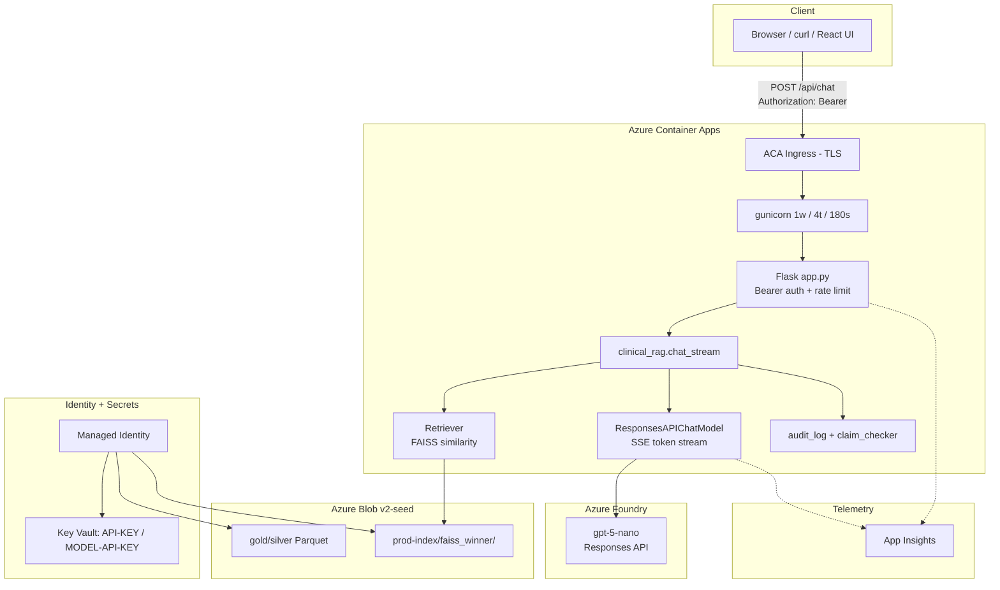

# Clinical RAG System for MIMIC-IV Data Analysis

A production-deployed Retrieval-Augmented Generation (RAG) system over MIMIC-IV clinical data. Started as an MSc dissertation that compared 54 model combinations (9 embeddings × 6 LLMs) on real patient records; the **v2** branch in this repo is the post-dissertation refactor that ships the winning configuration as an authenticated, observable, Azure-hosted service with a per-request audit trail.

Live endpoint: `https://msc-rag-v2-api.ashyplant-95cd2fd0.uksouth.azurecontainerapps.io`

For a commit-by-commit log of the v2 refactor and the running cloud topology, see [STATUS.md](STATUS.md).

## What v2 is

| Concern | v1 (dissertation) | v2 (this branch) |
| --- | --- | --- |
| LLM | 6 local models via Ollama | `gpt-5-nano` via Azure AI Foundry Responses API (with reasoning summaries) |
| Streaming | Pseudo-stream (full response chunked) | True token-by-token SSE over Responses API |
| Web framework | Flask, no auth, open CORS, `debug=True` | Flask + gunicorn, Bearer auth, restricted CORS, flask-limiter, fail-closed |
| Data | Local pickles + FAISS on disk | Parquet + FAISS in Azure Blob, downloaded on cold start |
| Secrets | `.env` only | Key Vault → Managed Identity → ACA secret refs |
| Observability | `print()` | structlog + Azure Monitor OpenTelemetry distro → App Insights |
| Trust / safety | None | Per-request JSON audit log + claim checker flags ungrounded sentences |
| Deploy | `python app.py` | Single-file Bicep (ACR + MI + KV + LA + AI + ACA env + ACA app) + `deploy.sh` |

## System architecture


```mermaid
graph TB
   subgraph "Client"
      U[Browser / curl / React UI]
   end

   subgraph "Azure Container Apps"
      ING[ACA Ingress - TLS]
      GUN[gunicorn 1w / 4t / 180s]
      FL[Flask app.py<br/>Bearer auth + rate limit]
      RAG[clinical_rag.chat_stream]
      RET[Retriever<br/>FAISS similarity]
      LLM[ResponsesAPIChatModel<br/>SSE token stream]
      AUD[audit_log + claim_checker]
   end

   subgraph "Azure Foundry"
      GPT[gpt-5-nano<br/>Responses API]
   end

   subgraph "Azure Blob v2-seed"
      PARQ[gold/silver Parquet]
      FAISS[prod-index/faiss_winner/]
   end

   subgraph "Identity + Secrets"
      KV[Key Vault: API-KEY / MODEL-API-KEY]
      MI[Managed Identity]
   end

   subgraph "Telemetry"
      AI[App Insights]
   end

   U -->|POST /api/chat<br/>Authorization: Bearer| ING
   ING --> GUN --> FL --> RAG
   RAG --> RET --> FAISS
   RAG --> LLM --> GPT
   RAG --> AUD
   MI --> KV
   MI --> PARQ
   MI --> FAISS
   FL -.-> AI
   LLM -.-> AI
```

For the full end-to-end request walkthrough, see [STATUS.md § End-to-end flow](STATUS.md).

## Repository layout

```text
msc_project/
├── RAG_chat_pipeline/          # Engine
│   ├── core/                   #   clinical_rag, retriever, content_processor,
│   │                           #   conversation_manager, embeddings_manager, main
│   ├── inference/              #   ResponsesAPIChatModel + get_llm() factory (Foundry)
│   ├── audit/                  #   audit_log writer + claim_checker
│   ├── observability.py        #   Azure Monitor OTel distro setup
│   ├── helper/                 #   entity_extraction, invoke
│   ├── utils/                  #   data_provider (real/synthetic, local/Blob), logger
│   ├── config/                 #   config + Pydantic settings
│   └── api/schemas/            #   request/response Pydantic models
├── platform/                   # Delivery surfaces
│   ├── api/app.py              #   Flask + gunicorn (Bearer auth, rate limit, /health)
│   ├── frontend/               #   React UI (sends Bearer header on every /api/* call)
│   └── cli_chat.py             #   CLI
├── benchmarks/                 # 54-combo evaluation framework (BioBERT semantic scoring)
├── data_engineering/           # One-shot ops
│   ├── seed_upload.py          #   pickles + FAISS + models → Blob
│   ├── parquet_convert.py      #   silver/gold pickles → Parquet (~10× compression)
│   └── SEED_MANIFEST.md        #   lineage record
├── infra/                      # IaC
│   ├── main.bicep              #   single-file: ACR + MI + KV + LA + AI + ACA env + ACA app
│   ├── deploy.sh               #   4-stage orchestrator
│   └── README.md               #   prereqs, cost, gotchas
├── notebooks/                  # MIMIC-IV → silver/gold pipeline (Jupyter)
├── synthetic_data/             # Synthetic data generator (fallback when real data absent)
├── mimic_sample_1000/          # Local bronze + silver + gold (also in Blob)
├── vector_stores/              # 9 local FAISS indexes (winner also in Blob prod-index/)
├── models/                     # 9 HF model snapshots (winner baked into image)
├── audit/                      # Runtime per-request JSON logs (gitignored)
├── report/                     # Dissertation artifacts
├── Dockerfile                  # Single-stage; bakes winner sentence-transformer
└── requirements.txt
```

## Inference flow

1. **Request enters** `POST /api/chat` with `Authorization: Bearer <API_KEY>`.
2. **Auth & rate limit** — `@require_api_key` reads `API_KEY` from env (injected from Key Vault via Managed Identity), fail-closed if absent. `flask-limiter` enforces 10/min per IP, exempts `/health`.
3. **Retrieval** — `Retriever.filter_candidate_documents` runs FAISS similarity over the winner index (loaded once at startup from `/tmp/faiss_winner/`, originally downloaded from Blob `prod-index/faiss_winner/` on cold start).
4. **Generation** — `ResponsesAPIChatModel._stream()` calls Foundry with `model=gpt-5-nano`, `reasoning={"effort": medium, "summary": "auto"}`, `max_output_tokens=16384`, `stream=True`. SSE deltas yield as `ChatGenerationChunk` content; reasoning summaries are buffered separately.
5. **Audit** — every request writes `/app/audit/<id>.json` with the question, retrieved docs, reasoning summaries, final answer, and any unsupported claims flagged by `claim_checker` (dosages, ICD codes, IDs that don't appear in retrieved evidence).
6. **Stream out** — final SSE event carries `audit_id`, `unsupported_claims`, and `reasoning_summaries`.

## Data layer

DataProvider abstracts source selection. Two switches in env:

| Switch | Effect |
| --- | --- |
| `USE_BLOB_DATA=true` | Read silver + `gold/chunked_docs.parquet` from Blob via fsspec/adlfs + DefaultAzureCredential. 105,371 LangChain Documents are reconstructed in memory. |
| `USE_BLOB_INDEX=true` | On cold start, download `prod-index/faiss_winner/` (367 MB) into `/tmp/faiss_winner/` and load. |

With both off, the system falls back to local pickles + on-disk FAISS, or auto-generates synthetic data if no real MIMIC-IV files are present.

## Models

### Winner (production)

| Component | Model | Why |
| --- | --- | --- |
| Embedding | `BiomedNLP-PubMedBERT-base-uncased-abstract-fulltext` | Highest F1 across the 54-combo grid on the BioBERT semantic scorer |
| LLM | `gpt-5-nano` via Azure AI Foundry Responses API | Reasoning summaries + true streaming + no GPU/Ollama dependency |

The winner sentence-transformer is baked into the Docker image to skip a ~400 MB Hugging Face Hub download on cold start.

### Evaluation grid (still in `benchmarks/`)

9 embedding models × 6 LLMs from the dissertation are preserved under `models/` and `vector_stores/`. The benchmark framework (`benchmarks/rag_evaluator.py`, `benchmarks/model_evaluation_runner.py`) still runs against the legacy Ollama path and is used for v3 expansion work — see `memory/project_benchmark_expansion_direction.md`.

## Getting started

### Local development

```bash
git clone https://github.com/DevNick21/msc_project.git
cd msc_project
git checkout v2

python -m venv venv
venv\Scripts\activate           # Windows
source venv/bin/activate        # macOS/Linux

pip install -r requirements.txt
```

`.env` (gitignored):

```ini
# Foundry inference
TARGET_URL=https://24800041-9760-resource.services.ai.azure.com/openai/v1
MODEL_API_KEY=<your Foundry key>
MODEL_DEPLOYMENT_NAME=gpt-5-nano
REASONING_EFFORT=medium
MAX_OUTPUT_TOKENS=16384

# Audit log dir
AUDIT_LOG_DIR=./audit

# Storage / data (leave false for purely local dev)
AZURE_STORAGE_ACCOUNT=faissprod
AZURE_BLOB_CONTAINER=v2-seed
USE_BLOB_DATA=false
USE_BLOB_INDEX=false

# API hardening
API_KEY=<your local Bearer token>
ALLOWED_ORIGINS=http://localhost:3000
FLASK_DEBUG=
```

Start the API:

```bash
python platform/api/app.py
# or, matching prod:
gunicorn --workers 1 --threads 4 --timeout 180 --chdir platform/api app:app
```

Start the React frontend (separate terminal):

```bash
cd platform/frontend
npm install
npm start
# visits http://localhost:3000, sends Bearer API_KEY on every /api/* call
```

Or use the convenience scripts: `start_app.bat` (Windows) / `start_app.sh` (macOS/Linux).

### Querying the API

```bash
export URL=http://localhost:5000
export API_KEY=<your key>

curl $URL/health    # no auth, 200 when ready

curl -X POST $URL/api/chat \
  -H "Authorization: Bearer $API_KEY" \
  -H "Content-Type: application/json" \
  -d '{"message":"What diagnoses for admission 22148233?"}'
```

The streaming endpoint returns Server-Sent Events with `event: content` deltas, followed by a final `event: done` carrying `audit_id`, `unsupported_claims`, and `reasoning_summaries`.

### Docker

```bash
docker build -t clinical-rag:dev .
docker run --rm -p 5000:5000 --env-file .env clinical-rag:dev
```

The image bakes only the winner sentence-transformer. Blob reads use `DefaultAzureCredential`, so on a developer laptop you need `az login` on the host (with `~/.azure` mounted) or a service-principal env trio (`AZURE_CLIENT_ID` / `AZURE_CLIENT_SECRET` / `AZURE_TENANT_ID`). In ACA, the Managed Identity covers this automatically.

## Deploy to Azure

Prereqs: `az` CLI, an Azure subscription with permission to create resource groups.

```bash
az login
bash infra/deploy.sh
```

This provisions, in one resource group:

- ACR (Basic) with `clinical-rag:<git-sha>` image pushed
- User-Assigned Managed Identity with `AcrPull`, `Key Vault Secrets User`, and `Storage Blob Data Reader` role assignments
- Key Vault (RBAC mode, 90d soft-delete, purge protection) holding `API-KEY` and `MODEL-API-KEY`
- Log Analytics workspace + workspace-based Application Insights
- ACA Environment + Container App (1–4 replicas, 2 vCPU / 4 GiB), Foundry env wired in, KV secrets injected via secret refs

Pause spend (keep deploy, zero compute):

```bash
az containerapp update --name msc-rag-v2-api --resource-group msc_project \
  --min-replicas 0 --max-replicas 1
```

Full IaC details, cost (~£40–50/mo floor), and ops commands live in [infra/README.md](infra/README.md) and [STATUS.md](STATUS.md).

## Data ingestion (one-shot, run once per dataset refresh)

```bash
# 1. Lift local bronze/silver/gold + FAISS + models into Blob v2-seed/
python -m data_engineering.seed_upload

# 2. Convert silver + gold pickles to Parquet inside Blob (~10× smaller)
python -m data_engineering.parquet_convert
```

See [data_engineering/SEED_MANIFEST.md](data_engineering/SEED_MANIFEST.md) for the lineage record (sizes, hashes, layer breakdown).

## Synthetic data (no MIMIC-IV credentials needed)

The DataProvider falls back to a synthetic generator when MIMIC-IV files are absent. It produces ~100 fictional patients with realistic admission structure, diagnoses, labs, prescriptions — enough to demo the full RAG pipeline without restricted-access data.

```bash
python -m RAG_chat_pipeline.utils.synthetic_data.synthetic_data_generator
```

A walkthrough lives in `synthetic_data_demo.ipynb`.

## Evaluation framework

The dissertation's evaluation suite is preserved under `benchmarks/`. It uses BioBERT-based semantic similarity (threshold 0.60) over six clinical question categories (header, diagnoses, procedures, labs, microbiology, prescriptions) to score precision / recall / F1.

```bash
# Single combo, quick test
python -m benchmarks.model_evaluation_runner single mini-lm deepseek --type quick

# Full grid (9 emb × 6 LLM, slow)
python -m benchmarks.model_evaluation_runner all --type full

# Report from existing runs
python -m benchmarks.model_evaluation_runner report
```

The legacy grid runs against Ollama-hosted LLMs; future expansion plans extend the grid via Foundry — see `memory/project_benchmark_expansion_direction.md`.

## Verified in production

| Layer | Evidence |
| --- | --- |
| Public ingress | `curl /health` → 200 |
| Bearer auth, fail-closed | missing `API_KEY` env → 503; wrong key → 401; correct → through |
| Rate limit | `/health` exempt; 10/min cap on `/api/chat`, 429 from req 11 |
| Blob-backed data | DataProvider reads `gold/chunked_docs.parquet` via MI; 105,371 Documents reconstructed |
| Blob-backed FAISS | Cold start downloads 367 MB to `/tmp/faiss_winner/` in ~25s |
| Responses API + reasoning | Real `gpt-5-nano` answers; 10–20s latency at medium effort |
| True streaming | 118+ SSE `content` events per response, tokens visible as they arrive |
| Audit log | JSON per request with `audit_id`, retrieved docs, reasoning, answer, flags |
| Claim checker | Flags sentences referencing data absent from retrieved evidence |
| App Insights | Auto-instrumented Flask + httpx traces in `traces` / `requests` tables |

## Known follow-ups (non-blocking)

| Item | Notes |
| --- | --- |
| Multi-replica rate limit not coherent | `flask-limiter` in-memory needs Redis if scaling beyond 1 replica |
| Custom OTel spans around retrieval / audit | Auto-instrumentation gives HTTP traces; richer spans need code |
| Layer C audit (paraphrased-claim drift) | Current checker catches dosage/code/ID mismatches but not semantic drift |
| 7.6 GB image | Switching to CPU-only torch wheel saves ~3.5 GB |
| Bake vs Blob-fetch winner ST | Baking is simpler; Blob fetch would shrink the image |

Full list in [STATUS.md § Known follow-ups](STATUS.md).

## v3 (next, separate effort)

Bicep was deliberately kept single-file so it compares cleanly with CloudFormation/CDK in a v3 AWS deploy. The application code is cloud-agnostic — only IaC + auth flow + Blob/S3 swap matters.

| Azure (v2) | AWS (v3) |
| --- | --- |
| Container Apps | ECS Fargate or App Runner |
| Container Registry | ECR |
| Managed Identity | IAM Task Role |
| Key Vault | Secrets Manager |
| Blob Storage | S3 |
| App Insights + Log Analytics | CloudWatch + X-Ray |
| Foundry (gpt-5-nano via Responses API) | Bedrock OR same OpenAI endpoint via direct HTTP |
| Bicep | CloudFormation or CDK |

## Citation

```bibtex
@software{clinical_rag_mimic,
  title  = {Clinical RAG System for MIMIC-IV Data Analysis},
  author = {Ekenedirichukwu Iheanacho},
  year   = {2025},
  url    = {https://github.com/DevNick21/Clinical_RAG_chat_bot}
}
```

## Medical disclaimer

This system is for educational and research purposes only. It must not be used for medical diagnosis or treatment decisions. Always consult qualified healthcare professionals for medical advice.

## License

MIT — see [LICENSE](LICENSE).
